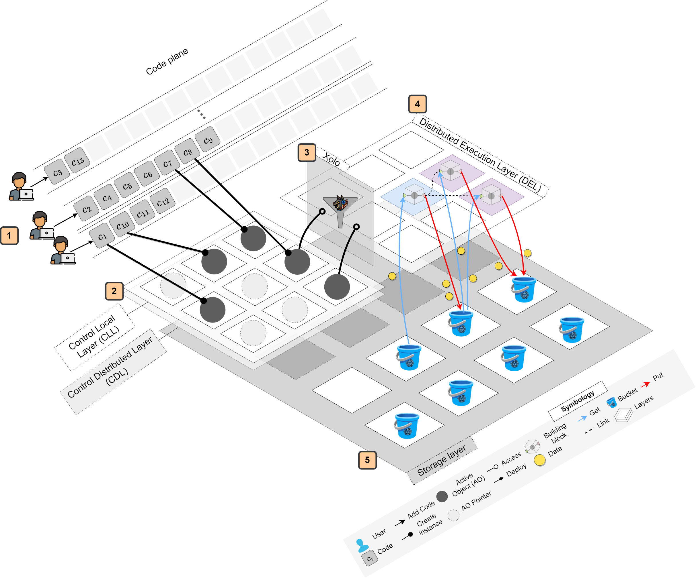

<p align="center">
  
</p>

<div align=center>
<a href="https://test.pypi.org/project/mictlanx/"></a>
</div>
<div align=center>
	<h1>Axo: <span style="font-weight:normal;"> High Available Execution Engine</span></h1>
</div>

**Axo** is a high available execution engine of the Axo platform, responsible for managing, executing, and orchestrating Active Objects (AO). The AO that encapsulates both data and behavior and can be executed remotely or locally like serverless functions.
<!-- **Axo** is a prototype active object system for intensive application. For now the source code is kept private, and it is for the exclusive use of the *Muyal-ilal* research group.  -->


<p align="center">
  <!--  -->
  
</p>


## Prerequisites 🧾
Before using or developing with Axo, ensure the following tools are installed and configured:

### 1. System Requirements
  - Python ≥ 3.9
  - Docker ≥ 28.3.2
### 2. Install Python Dependencies (Quick Start)
- Install [Poetry](https://python-poetry.org/)
  ```bash
  pip3 install -r requirements.txt
  ```
### 3. Development Environment (Recommended)
For development and contribution, we recommend using Poetry for environment and dependency management.

- Install poetry shell
  ```
  poetry self add poetry-plugin-shell
  ```
- Init a new virtual environment 
  ```
  poetry shell
  ```
- Install the dependencies
  ```
  poetry lock & poetry install
  ```

<p align="right">(<a href="#top">back to top</a>)</p>

### 4. Distributed mode 
For distributed mode you must deploy a storage service and at least one ```axo-endpoint```

```bash
chmod +x ./deploy_storage.sh && chmod +x ./deploy_endpoint.sh  && ./deploy_storage.sh && deploy_endpoint.sh
```

## Getting started 🚀

This example demonstrates how to build and test a distributed, active-object-based calculator using the Axo framework. It showcases how Axo handles method orchestration in local and distributed contexts using decorated methods and runtime context managers.

### 📦 Key Concepts

1. ```Axo```: **Base class for active objects**

    All active objects must inherit from Axo. This class enables the object to interact with Axo runtimes (local or distributed) and use Axo features like ```persistify()``` or dynamic endpoint binding.

2. ```@axo_method```: **Method decorator**

    This decorator intercepts calls to decorated methods and routes them through the Axo runtime, collecting context like endpoint, bucket ID, key, etc.

    - If the runtime is local, the method executes directly.

    - If the runtime is distributed, the method is remotely dispatched to the appropriate endpoint where the active object lives.

3. ```AxoContextManager```: **Runtime context**

    This context manager sets up the runtime:

    - ```AxoContextManager.local()```: sets up a local runtime (for testing or development)

    - ```AxoContextManager.distributed(...)```: sets up a distributed runtime using DistributedEndpointManager

4. ```DistributedEndpointManager```: **Defines remote endpoints**

    Used to manage Axo endpoints in distributed mode. Each endpoint corresponds to a remote service capable of executing active object methods.

## 📐 Example: Distributed Calculator
We define a class ```Calculator``` that inherits from ```Axo```. It contains four math operations, each decorated with ```@axo_method```.

```python
class Calculator(Axo):
    @axo_method
    def sum(self, xs: List[float], **kwargs) -> float:
        return sum(xs)

    @axo_method
    def substract(self, xs: List[float], **kwargs) -> float:
        return reduce(lambda x, y: x - y, xs)

    @axo_method
    def divide(self, xs: List[float], **kwargs) -> float:
        return reduce(lambda x, y: x / y, xs)

    @axo_method
    def mult(self, xs: List[float], **kwargs) -> float:
        return reduce(lambda x, y: x * y, xs)
```
All methods accept ```xs: List[float]``` and return a float. The **kwargs are internally injected by the ```@axo_method``` decorator and include Axo-specific routing metadata like ```axo_key```, ```axo_bucket_id```, etc.


### 🧪 Running the Tests
Use pytest to run the Calculator tests:
```bash
pytest 
```

<!-- CONTRIBUTING -->
## Contributing

Contributions are what make the open source community such an amazing place to learn, inspire, and create. Any contributions you make are **greatly appreciated**.

If you have a suggestion that would make this better, please fork the repo and create a pull request. You can also simply open an issue with the tag "enhancement".
Don't forget to give the project a star! Thanks again!

1. Fork the Project
2. Create your Feature Branch (`git checkout -b feature/AmazingFeature`)
3. Commit your Changes (`git commit -m 'Add some AmazingFeature'`)
4. Push to the Branch (`git push origin feature/AmazingFeature`)
5. Open a Pull Request

<p align="right">(<a href="#top">back to top</a>)</p>


<!-- LICENSE -->
## License

Distributed under the MIT License. See `LICENSE.txt` for more information.

<p align="right">(<a href="#top">back to top</a>)</p>


<!-- CONTACT -->
## Contact


 Ignacio Castillo - [@NachoCastillo]() - jesus.castillo.b@cinvestav.mx (Software Architect / Design)

<p align="right">(<a href="#top">back to top</a>)</p>
